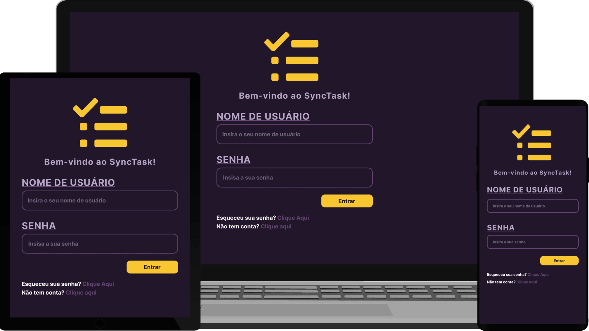

<h1 align="center">
  <a href="#" target="_blank"> SyncTask </a>
</h1>
  

  
  
  
   
  <a href="#-tecnologias">Tecnologias</a>&nbsp;&nbsp;&nbsp;|&nbsp;&nbsp;&nbsp;
  <a href="#-projeto">Projeto</a>&nbsp;&nbsp;&nbsp;|&nbsp;&nbsp;&nbsp;
  <a href="#-coltec">PUC</a>&nbsp;&nbsp;&nbsp;|&nbsp;&nbsp;&nbsp;
  <a href="#-layout"> Layout </a>&nbsp;&nbsp;&nbsp;|&nbsp;&nbsp;&nbsp;
  

 

## 🚀 Tecnologias
:

💻 Code
- HTML
- CSS
- JS

🎨 Design
- Figma
- Mockups
- SVG Icons

## 💻 Projeto
O projeto "SyncTask".

## 🎓 COLTEC

 
 ## 🎨 Layout
 Você pode visualizar o Layout [Nesse Link](https://www.figma.com/file/m4IqdmKSwHLEDpEbcKeXUx/SyncTask?type=design&node-id=80%3A123&mode=design&t=OxrzrWP2vxBGO2vJ-1). Você precisa de conta do [Figma](http://figma.com/) para vê-lo.
 
# Reforged_SyncTask
